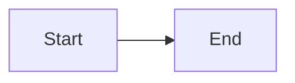

# CLAUDE.md

This file provides guidance to Claude Code (claude.ai/code) when working with code in this repository.

## Project Overview

Vibe AI Infra is a static website hub that tracks progress across multiple Nano AI Infrastructure projects. It's built with Vite + React + TypeScript using a minimal dark theme.

## Development Commands

```bash
# Install dependencies
npm install

# Start development server (http://localhost:5173)
npm run dev

# Type check without building (catches TypeScript errors)
npm run check

# Build for production
npm run build

# Run full CI pipeline (type check + build)
npm run ci

# Preview production build locally
npm run preview

# Render Mermaid diagrams to SVG
npm run render-mermaid

# Push with validation (RECOMMENDED over git push)
npm run push
```

## Pre-Commit and Pre-Push Workflow

**IMPORTANT: Always run validation before pushing to GitHub.**

### Why This Matters

- `npm run dev` does NOT run full TypeScript type checking
- TypeScript errors (unused variables, type mismatches) only appear during `astro check` or build
- GitHub Actions will fail if these errors aren't caught locally
- Broken deployments waste time and block the site from updating

### Required Validation Before Pushing

**Before committing or pushing, ALWAYS run:**

```bash
npm run ci
```

This runs:
1. `npm run check` - Full TypeScript type checking
2. `npm run build` - Production build verification

### Safe Push Workflow

**Option 1: Use npm run push (RECOMMENDED)**

```bash
npm run push
```

This automatically runs pre-push validation before pushing. If validation fails, the push is aborted.

**Option 2: Manual validation**

```bash
npm run ci && git push
```

**NEVER use `git push` directly without running `npm run ci` first.**

### What Gets Checked

The validation catches:
- TypeScript type errors (e.g., Date arithmetic operations)
- Unused variables and imports
- Astro component type mismatches
- Build failures due to syntax or dependency issues

### Example Failure

```typescript
// ❌ WRONG - Date arithmetic fails TypeScript check
entries.sort((a, b) => b.data.date - a.data.date);

// ✅ CORRECT - Use .getTime() for numeric comparison
entries.sort((a, b) => b.data.date.getTime() - a.data.date.getTime());
```

This error only appears in `npm run check`, not in `npm run dev`.

## Architecture

### Core Structure

- `src/projects.ts` - Single source of truth for all project data. Contains:
  - `projects` array: All 13 projects with status, goals, descriptions
  - `categories` array: The 5 top-level categories (Silicon, Virt, Compiler, Framework, Agent)
  - `statusOrder`: Controls sorting priority (Done > WIP > TBD)

- `src/App.tsx` - Main component that:
  - Computes statistics (done/wip/tbd counts)
  - Groups and sorts projects by category
  - Renders project cards with GitHub links

- `src/App.css` - Minimal dark theme styling matching GitHub/Vercel aesthetic

### Data Flow

1. `projects.ts` exports `projects` array as single source of truth
2. `App.tsx` filters projects by category and sorts by status
3. Component renders stats, category sections, and project cards

## Adding/Updating Projects

Edit `src/projects.ts` directly:

```typescript
{
  id: 'unique-id',
  name: 'Project Name',
  category: 'Silicon', // Must be one of: Silicon, Virt, Compiler, Framework, Agent
  status: 'WIP',       // 'TBD' | 'WIP' | 'Done'
  github: 'repo-name', // Optional - links to github.com/lastweek/repo-name
  description: 'Brief description of the project',
  goals: [
    'Specific goal 1',
    'Specific goal 2',
  ],
}
```

## GitHub Integration

- Set `base` path in `vite.config.ts` to match your repo name
- `github: 'repo-name'` in project data adds a GitHub icon linking to `github.com/lastweek/repo-name`
- No automation - status updates are manual via editing `src/projects.ts`

## Styling Conventions

- **Overall theme**: Light theme with soft gradients
- **Code blocks**: GitHub Light theme colors
  - Keywords: `#d73a49` (red)
  - Strings: `#032f62` (dark blue)
  - Comments: `#6a737d` (gray, italic)
  - Functions: `#6f42c1` (purple)
  - Numbers: `#005cc5` (blue)
  - Background: `#ffffff` (white)
  - Border: `#e1e4e8`
- **Status colors**:
  - Done: green `#3fb950`
  - WIP: yellow `#d29922`
  - TBD: gray `#8b949e`
- **Accent**: blue `#58a6ff` for links
- **Font**: SF Mono, Menlo, Monaco, Consolas for code
- **Border**: `rgba(255,255,255,0.1)` for subtle separation

## TIL (Today I Learned) Creation Workflow

When creating TIL entries, follow this process:

### Input
- User may provide **multiple topics** learned in a single day
- Content can be raw notes, links, code snippets, explanations, etc.

### Processing
1. Parse and deeply understand all provided content
2. Identify distinct topics/themes within the material

### When to Merge vs Separate Pages

**Use judgment based on topic relatedness:**

**Merge into ONE page when topics are:**
- About the same technology/project (e.g., both about SGLang)
- Conceptually related (e.g., native support + fallback mechanism)
- Part of a learning progression (e.g., basic concept + advanced application)
- Fewer than 3 distinct topics that tell a coherent story

**Create SEPARATE pages when topics are:**
- Completely different technologies (e.g., Kubernetes networking + CSS styling)
- Different domains (e.g., backend architecture + frontend design)
- Independent learning goals with no narrative connection
- 3+ topics that would make a single page too long/unfocused

**Examples:**
- ✅ **Merge**: "GLM-5 native support" + "SGLang Transformers backend" (both about SGLang model support)
- ✅ **Merge**: "K8s networking" + "K8s security" (both about Kubernetes)
- ❌ **Separate**: "K8s networking" + "CSS grid layout" (completely different domains)
- ❌ **Separate**: "Python async/await" + "Bash scripting basics" (unrelated topics)

### Output Format
Create a single markdown file in `src/content/til/` with:

1. **One Overall Title**: Short, concise, precise summary of everything learned that day
2. **Per-Topic Sections**:
   - **One-liner**: Simple, brief summary sentence for each topic
   - **Details**: Expanded explanation with content, code, links, etc.

### Example Structure
```markdown
---
title: "K8s Networking, Linux Namespaces, and Container Security"
description: "Learned about Kubernetes pod networking, Linux namespace isolation, and container security best practices"
date: 2025-02-12
tags: ["kubernetes", "linux", "security"]
---

## K8s Pod Networking
Learned how pods communicate within a cluster using CNI plugins and overlay networks...

## Linux Namespace Isolation
Explored how Linux namespaces provide process isolation through mount, network, and IPC namespaces...

## Container Security
Discovered security best practices including...
```

### File Location
- Create new TIL entries in: `src/content/til/YYYY-MM-DD-topic.md`
- Each file becomes a page at: `/til/YYYY-MM-DD-topic`
- Main listing page: `/til`

### Mermaid Diagrams
TIL entries support Mermaid diagrams for visualizing concepts:

1. **Write diagrams** in markdown using ` ```mermaid ` code blocks
2. **Render them** by running: `npm run render-mermaid`
3. **Diagrams are converted** to SVG and saved in `public/mermaid/`
4. **Markdown is updated** to reference the SVG files

Example:
````markdown

````

After running `npm run render-mermaid`, this becomes an embedded SVG image.

## Adding GitHub URLs to Nano Projects

When adding or updating a GitHub URL for any nano project, follow this workflow:

### Required Steps

1. **Analyze the repository** by reading the code from the GitHub URL
2. **Generate a one-liner introduction** - A concise, single-sentence summary of what the project does
3. **Generate a one-page introduction** - A comprehensive overview covering:
   - Project overview and purpose
   - Key technologies and architecture
   - Main features and capabilities
   - Implementation details and design decisions

### Where Content Goes

- **One-liner**: Update the `description` field in the project's YAML file
- **One-page introduction**: Create/update the project's detail page in `src/content/projects/`

### Example Workflow

```bash
# 1. User provides: "Add URL https://github.com/lastweek/nano-train to Nano Train"

# 2. Analyze the repo
# - Read README.md, main source files, documentation
# - Understand architecture, key components, implementation

# 3. Generate content
# - One-liner: "Distributed training framework implementing tensor parallelism and pipeline parallelism for large-scale LLM training"
# - One-page: Full technical overview with architecture, features, implementation details

# 4. Update files
# - Edit src/content/projects/framework.yaml
# - Create/update src/content/projects/framework/nano-train.md
```

### Content Guidelines

**One-liner requirements:**
- Single sentence
- Describes core purpose and key technique
- Technology-agnostic (focus on what, not how)
- Under 20 words

**One-page introduction requirements:**
- 300-800 words
- Technical depth appropriate for the project stage
- Covers: architecture, key features, design decisions
- Include diagrams if helpful (Mermaid supported)
- Reference actual implementation details from code

### Examples

See existing implementations:
- `src/content/projects/virt/nano-k8s-tutorial.md` - Production K8s LLM serving
- `src/content/projects/virt/nano-sandbox.md` - Container sandbox architecture
